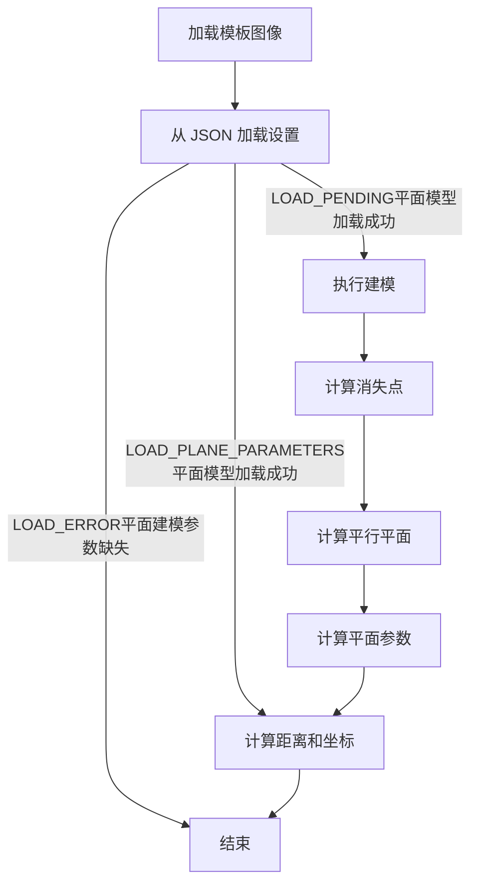

# 算法流程简述 

## 过滤直线(`FilterLines`) 

接受线段的向量作为输入 计算每条线段的斜率（m）和截距（c） 

根据线段的斜率和角度进行筛选（拒绝接近水平和垂直的线段） 

在向量中存储相关的线段信息，包括端点、斜率、截距和长度 可选地，将线段数量限制为前15条最长的线段 

## 检测直线(`GetLines`) 

应用霍夫线变换来检测边缘图像中的线段 

将线段的坐标转换回原始图像坐标空间 

调用FilterLines函数以筛选和选择相关的线段 

## 计算消失点(`GetVanishingPoint`) 

接受一个经过筛选的线段的向量作为输入 

实现类似RANSAC的算法来寻找消失点 

遍历两条线段的组合，计算它们的交点并评估误差 选择具有最小误差的消失点 

## 计算消失点 (`calculateVanishingPoint`)

调用 `GetLines()` 来检测图像中的线条 

调用 `GetVanishingPoint`() 来计算消失点

## 计算平行平面 (`calculatingParallelPlane`) 

计算通过消失点的线的方向向量

计算由点对形成的平面的交线 

计算两条线共面平面的系数 将结果存储在 `planeParameters_` 中

## 计算平面参数 (`calculatePlaneParameters`) 

使用先前计算的 `verticalLinePair_` 之间的距离和 `planeParameters_` 计算平面方程的系数，并更新 `planeParameters_` 

## 计算像素到坐标 (`calculatePixel2Coordinate`) 

计算给定像素的方向向量 使用 `planeParameters_` 计算线与平面的交点 返回交点 

## 计算两点之间的距离 (`calculateDistanceBetweenPoints`)

 计算两点的方向向量 使用 `planeParameters_` 计算平面上的交点 计算交点之间的距离并返回 

## 加载设置 (`loadSettings`)

从 JSON 文件加载设置 根据结果设置 `settingsLoaded` 并初始化必要的参数 如果设置待处理，保存平面参数

## 保存平面参数 (`savePlaneParameters`) 

如果设置是`LOAD_PENDING`，将平面参数保存到设置中

  

    <h2>算法流程简述</h2>
    <h3>过滤直线 (FilterLines)</h3>
    
接受线段的向量作为输入 计算每条线段的斜率（m）和截距（c）

    
根据线段的斜率和角度进行筛选（拒绝接近水平和垂直的线段）

    
在向量中存储相关的线段信息，包括端点、斜率、截距和长度 可选地，将线段数量限制为前15条最长的线段

    <h3>检测直线 (GetLines)</h3>
    
应用霍夫线变换来检测边缘图像中的线段

    
将线段的坐标转换回原始图像坐标空间

    
调用FilterLines函数以筛选和选择相关的线段

    <h3>计算消失点 (GetVanishingPoint)</h3>
    
接受一个经过筛选的线段的向量作为输入

    
实现类似RANSAC的算法来寻找消失点

    
遍历两条线段的组合，计算它们的交点并评估误差 选择具有最小误差的消失点

    <h3>计算消失点 (calculateVanishingPoint)</h3>
    
调用GetLines()来检测图像中的线条

    
调用GetVanishingPoint()来计算消失点

  

  

    
  

  

    <h3>计算平行平面 (calculatingParallelPlane)</h3>
    
计算通过消失点的线的方向向量

    
计算由点对形成的平面的交线

    
计算两条线共面平面的系数 将结果存储在planeParameters_中

    <h3>计算平面参数 (calculatePlaneParameters)</h3>
    
使用先前计算的verticalLinePair_之间的距离和planeParameters_计算平面方程的系数，并更新planeParameters_

  

  

    <h3>计算两点之间的距离 (calculateDistanceBetweenPoints)</h3>
    
计算两点的方向向量 使用planeParameters_计算平面上的交点 计算交点之间的距离并返回

    <h3>加载设置 (loadSettings)</h3>
    
从 JSON 文件加载设置 根据结果设置settingsLoaded并初始化必要的参数 如果设置待处理，保存平面参数

    <h3>保存平面参数 (savePlaneParameters)</h3>
    
如果设置是LOAD_PENDING，将平面参数保存到设置中

  

